# Lý thuyết
# Thực hành
## Kịch bản 1: Cho phép máy tính trong LAN Ping ra ngoài mạng Internet
Nguyên lý hoạt động để có cách cấu hình rule như sau:
1. Máy Windows trong LAN gửi gói tin ICMP echo request đến internet. Do địa chỉ đích nằm ngoài mạng LAN, packet được gửi đến Default Gateway 172.16.1.1 (interface `ens37`) của Linux Firewall.
2. Linux Firewall sẽ nhận packet trên interface `ens37` và thực hiện routing để chuyển tiếp packet qua interface `ens33` ra ngoài mạng. Vì packet đi xuyên qua Firewall nên nó sẽ được xử lý bởi chain `Forward`.
3. Để gói tin reply biết nơi gửi về nên phải thực hiện đổi IP trước khi packet đi ra `ens33`, Firewall thực hiện SNAT trong chain POSTROUTING, chuyển source IP thành địa chỉ của ens33.
4. Gói ICMP echo reply từ internet được Firewall nhận và chuyển tiếp trở lại máy Windows trong Lan

```shell
sudo iptables -A FORWARD -i ens37 -o ens33 -s 172.16.1.0/24 -p icmp --icmp-type any -j ACCEPT

sudo iptables -A FORWARD -i ens33 -o ens37 -d 172.16.1.0/24 -p icmp --icmp-type any -j ACCEPT

sudo iptables -t nat -A POSTROUTING -o ens33 -s 172.16.1.0/24 -j SNAT --to-source 192.168.132.145
```
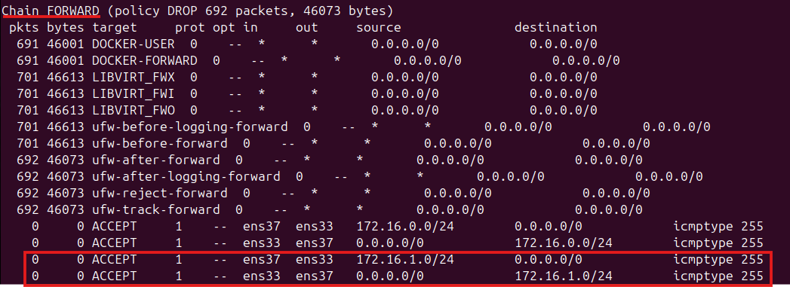
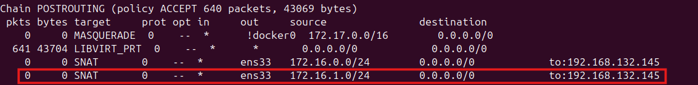
Kết quả:
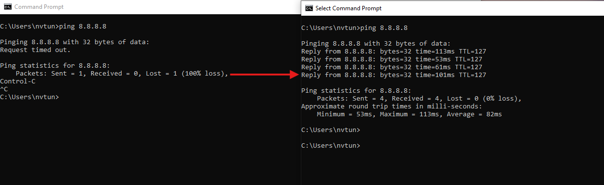

## Kịch bản 2: Cho phép máy tính trong LAN truy vấn DNS ra Internet 
```shell
sudo iptables -A FORWARD -i ens37 -o ens33 -s 172.16.1.0/24 -p udp --dport 53 -j ACCEPT 

sudo iptables -A FORWARD -i ens33 -o ens37 -d 172.16.1.0/24 -p udp --sport 53 -j ACCEPT 

sudo iptables -t nat -A POSTROUTING -o ens33 -s 172.16.1.0/24 -j SNAT --to-source 192.168.132.145
```

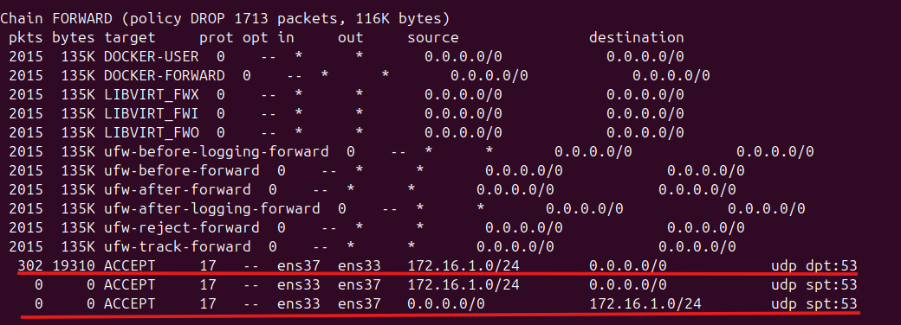

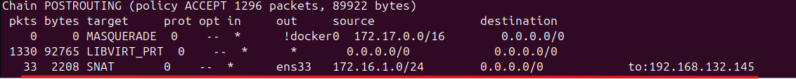

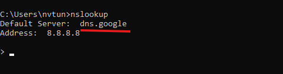


## Kịch bản 3. Cho phép máy tính trong mạng LAN truy cập được các website từ mạng Internet

Cần sự kết hợp của kịch bản 2 vì trong quá tình này có sự tham ra của DNS
```shell
sudo iptables -A FORWARD -i ens37 -o ens33 -s 172.16.1.0/24 -p tcp -m multiport --dport 80,443 -j ACCEPT
sudo iptables -A FORWARD -i ens33 -o ens37 -d 172.16.1.0/24 -p tcp -m multiport --sport 80,443 -j ACCEPT 
```

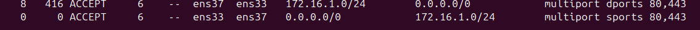

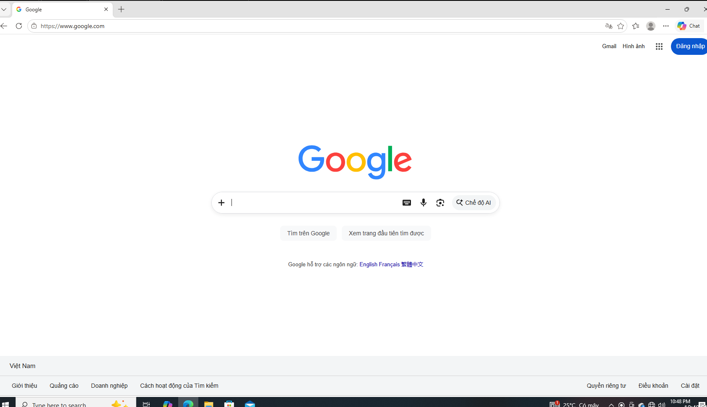

## Kịch bản 4


-Trường hợp 1:
```shell

iptables -t nat -A POSTROUTING -o ens38 -s 172.16.1.0/24 -j SNAT --to-source 10.0.0.1

iptables -A FORWARD -i ens37 -o ens38 -s 172.16.1.0/24 -p udp --dport 53 -j ACCEPT 

iptables -A FORWARD -i eth38 -o ens37 -d 172.16.1.0/24 -p udp --sport 53 -j ACCEPT 

iptables -A FORWARD -i ens37 -o ens38 -s 172.16.1.0/24 -p ICMP -j ACCEPT 

iptables -A FORWARD -i ens38 -o ens37 -d 172.16.1.0/24 -p ICMP -j ACCEPT 

iptables -A FORWARD -i ens37 -o ens38 -s 172.16.1.0/24 -p tcp --dport 80 -j ACCEPT 

iptables -A FORWARD -i ens38 -o ens37 -d 172.16.1.0/24 -p tcp --sport 80 -j ACCEPT 

```

kết quả:
- cấu hình:
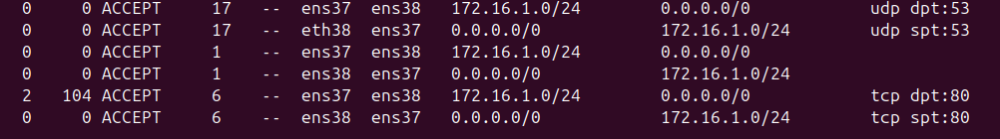

- kiểm tra ping:
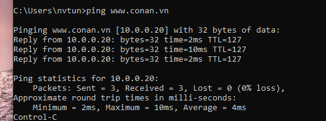
- Kiểm tra trên browser:
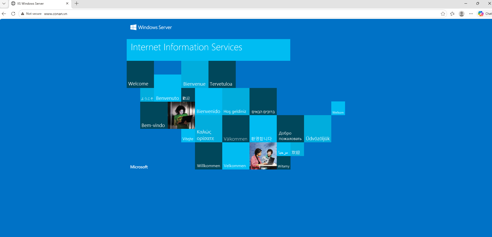
- Trường hợp 2:

```shell
iptables -t nat -A PREROUTING -i ens33 -d 192.168.132.145 -p tcp --dport 80 -j DNAT --to-destination 10.0.0.20:80 

iptables -A FORWARD -i ens33 -o ens38 -d 10.0.0.20 -p tcp --dport 80 -j ACCEPT

iptables -A FORWARD -i ens38 -o ens33 -s 10.0.0.20 -p tcp --sport 80 -j ACCEPT 
```
kết quả:
- cấu hình:


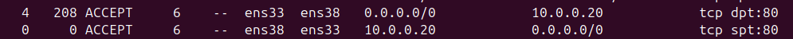
- truy cập bằng IP:

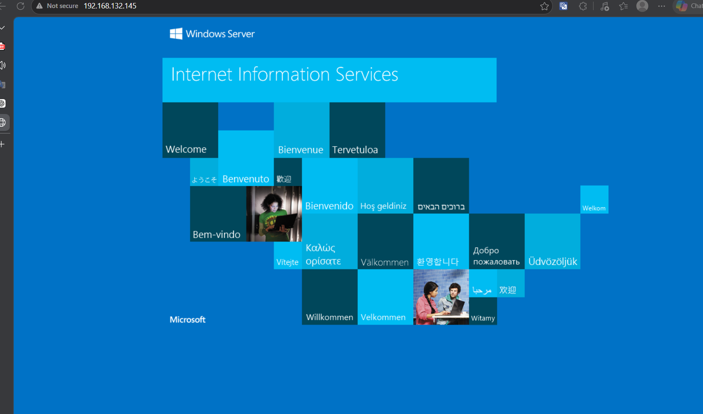
- truy cập bằng domain:

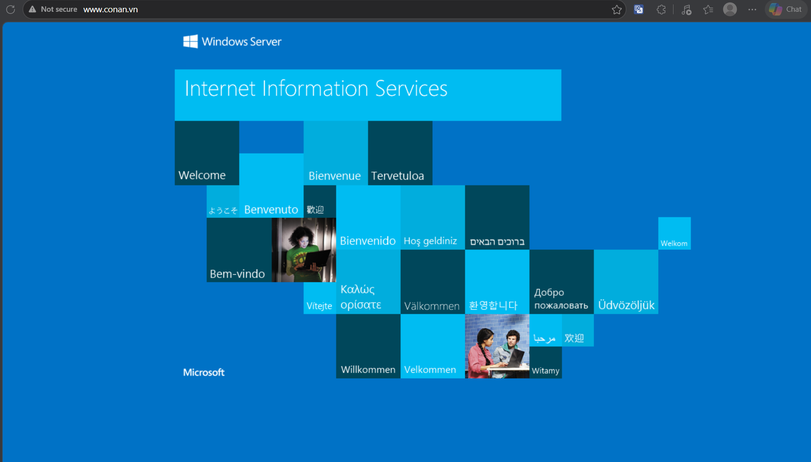
## Kịch bản 5:

```shell
iptables -A FORWARD -i ens37 -o ens38 -s 172.16.1.0/24 -p tcp -m multiport --dport 25,110 -j ACCEPT 

iptables -A FORWARD -i ens38 -o ens37 -d 172.16.1.0/24 -p tcp -m multiport --sport 25,110 -j ACCEPT 
```
- kết quả:
cấu hình


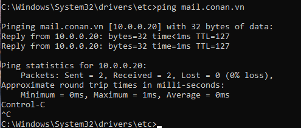

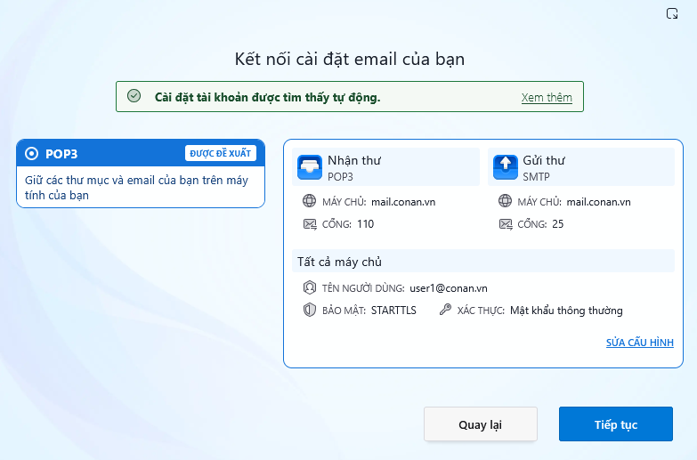

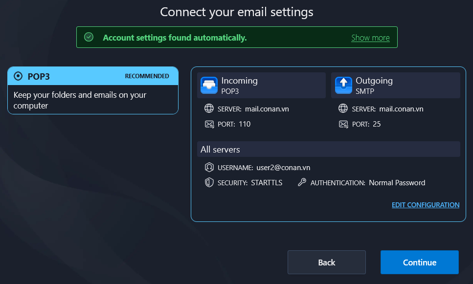
trường hợp 2:

```shell
iptables -t nat -A PREROUTING -i ens33 -d 192.168.132.145 -p tcp --dport 110 -j DNAT --to-destination 10.0.0.20:110 
iptables -t nat -A PREROUTING -i ens33 -d 192.168.132.145 -p tcp --dport 25 -j DNAT --to-destination 10.0.0.20:25 

iptables -A FORWARD -i ens33 -o ens38 -d 10.0.0.20 -p tcp -m multiport --dport 25,110 -j ACCEPT 
iptables -A FORWARD -i ens38 -o ens33 -s 10.0.0.20 -p tcp -m multiport --sport 25,110 -j ACCEPT 
```

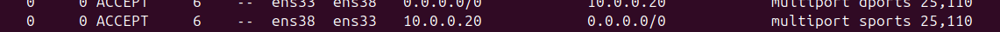

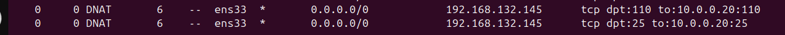


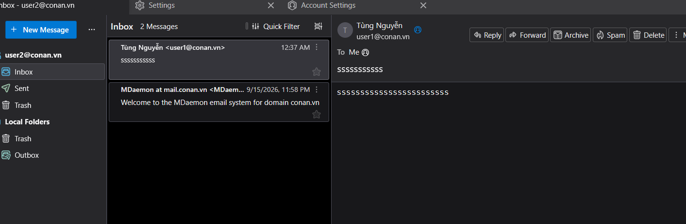

