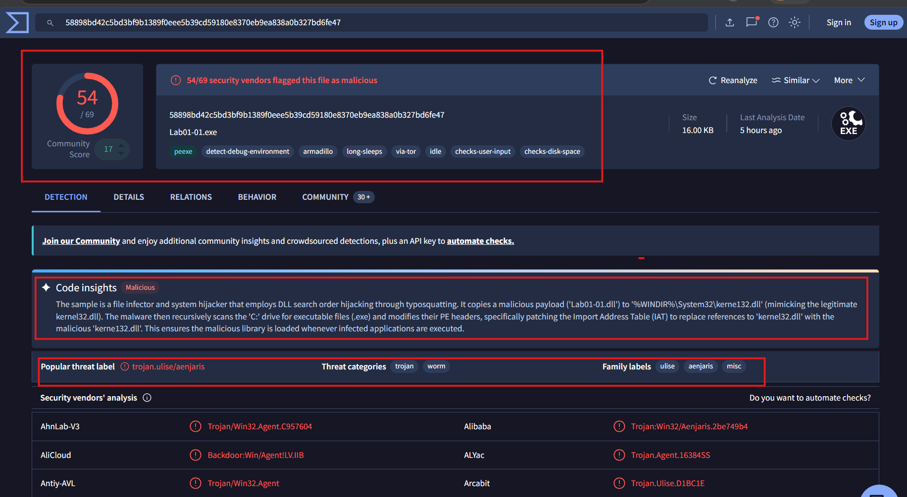
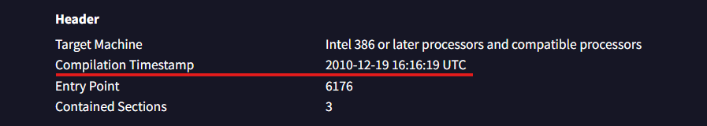
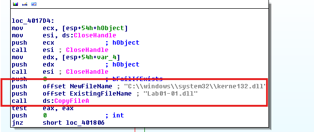
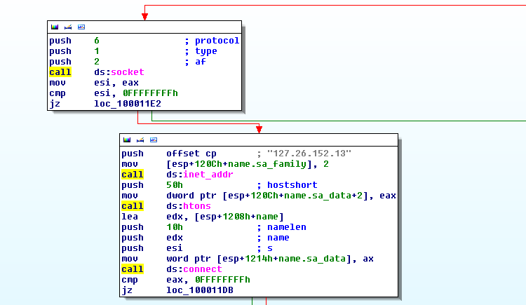

# Cấu trúc File PE
File PE là định dạng file thực chuẩn của Windows, phần mở rộng thường có (.exe, .dll, .sys). Cấu trúc của File PE bao gồm:
```
├── DOS Header
├── DOS Stub
├── NT Headers
  ├── File Header
  └── Optional Header
    └── Data Directories
├── Section Headers
└── Sections
```
Dưới đây là tóm tắt định nghĩa về các thành phần:

- DOS Header: Bao gồm 64 byte đầu tiên của file PE, có chứa signature "MZ". Header này đảm bảo tương tích ngược với MS-DOS và chứa một chương trình stub để in thông báo khi chạy trong môi trường MS-DOS. DOS header có vai trò trong việc định vị PE Header
- DOS Stub: Là một chương trình MS-DOS nhỏ, khi chạy trong môi trường DOS cũ sẽ in ra " This program cannot be run in DOS mode"
- NT Header: Nó bao gồm File Header và Optional Header. Nó chứa field Signature để xác định loại file
- File Header (IMAGE_FILE_HEADER): Chứa các thông tin về file để Windows biết cách xử lý file đó, bao gồm kiến trúc CPU mà chương trình được biên dịch cho, chẳng hạn như x86 hoặc x64.
- Optional Header(IMAGE_OPTIONAL_HEADER): Đây là thành phần bắt buộc đối với file `.exe` và `.dll`. Nó chứa nhiều field cung cấp thông tin cho Windows Loader, giúp Windows biết cách và vị trí nạp chương trình vào bộ nhớ.
- Section Table: Mỗi section header chứa thông tin mô tả về section đó chẳng hạn như kích thức, vị trí, thuộc tính.
- Section: Đây là nơi thực sự chứa các đoạn mã thực thi, dữ liệu và tài nguyên mà chương trình sử dụng. Cụ thể bao gồm `.text`, `.data`, `.rdata`, `.bss`, `.rsrc`, `.reloc`.

Sau khi đi qua hiểu cơ bản các thành phần của nó. Bây giờ chúng ta sẽ đi sâu vào bên trong các Header sẽ tìm hiểu fields bên trong sẽ mang lại những giá trị gì trong việc phân tích Malware:
```
├── DOS Header
  ├── Field: e_magic
  └── Field: e_lfanew
├── DOS Stub
├── NT Headers
  ├── Field: Signature
  ├── File Header
    ├── Field: Machine
    ├── Field: NumberOfSections
    ├── Field: TimeDateStamp
    ├── Field: SizeOfOptionalHeader
    └── Field: Characteristics
  └── Optional Header
    ├── Field: AddressOfEntryPoint
    ├── Field: ImageBase
    └── Data Directories
 ├── Section Headers
 └── Sections
 ```

`e_magic`: Là DOS signature. Đối với file PE, giá trị này luôn là `4D 5A` ở dạng hex, tương ứng với `MZ` trong ASCII.

`e_lfanew`: Giá trị này nằm tại offset `0x3C` của file, cho biết offset đến vị trí bắt đầu của NT Header, cũng chính là nơi chứa PE Signature. Giá trị này cung cấp cho Windows Loader thông tin cần thiết để tìm và thực thi PE, Mặc dù phía trước NT Header còn có DOS Header và DOS Stub. `e_lfanew` có kích thước DWORD tức 4 byte.

`Signature`: Giá trị này xác định file thuộc định dạng PE, đồng thời đánh dấu điểm bắt đầu của NT Header. Nó có kích thức 4 byte (50 45 00 00).

`Machine`: Chứa thông tin về loại kiến trúc CPU mà file PE được thiết kế để chạy trên. Ví dụ x86, x64, ARM,..

`NumberOfSections`: Cho biết số lượng section có trong file PE.

`TimeDateStamp`: Chứa biểu diễn dạng số của thời gian tạo file, được tính bằng số giây kể từ 00:00 /1/1/1970.

`Characteristics`: Trường này chứa một tập hợp các flag biểu thị những thuộc tính khác nhau của file. Hiện có 16 flag được định nghĩa, mặc dù có một số đã lỗi thời và không còn được sử dụng. Một số flag quan trọng như:
`IMAGE_FILE_EXECUTABLE_IMAGE`: Cho biết file có thể thực thi
`IMAGE_FILE_32BIT_MACHINE`: Cho biết file được tạo cho kiến trúc 32-bit.
`IMAGE_FILE_DLL`: Cho biết file là một Dynamic Link Library.

`AddressOfEntryPoint`: Vị trí của lệnh đầu tiên của chương trình sẽ được thực thi.

`ImageBase`: Cho biết địa chỉ ưu tiên trong bộ nhớ ảo mà Windows Loader nên nạp PE và dữ liệu của nó vào.

Muốn biết thêm thông tin về các field, bạn có thể truy cập vào https://learn.microsoft.com/en-us/windows/win32/debug/pe-format


# Lab 1
Tổng quan: Đây là bài lab mở đầu, chủ yếu là sử dụng các công cụ đọc các report của nó.

Q1: Hãy tải các tệp lên trang http://www.VirusTotal.com/ và xem các báo cáo phân tích. Có tệp nào trong số đó khớp với các chữ ký (signature) antivirus đã biết hay không?\
Answer: Theo như kết quả thì có 54/69 engine của các hãng bảo mật khác nhau xác nhận đây là một file malicious. Loại threat là `trojan` `worm`. 



Q2: File này được biên dịch khi nào?
Answer: nó được biên dịch `2010-12-19 16:16:19 UTC` 



Q3: Có dấu hiệu nào cho thấy một trong hai tệp này đã bị đóng gói (packed) hoặc làm rối mã (obfuscated) không? Nếu có, những dấu hiệu đó là gì?
Các điều cần kiểm tra: Entropy, Entry Point, Imports, Strings, Section, Section permissions\
Answer: File trên không bị pack sau khi kiểm tra bằng PEview và PEiD.

Q4: Có import nào gợi ý malware này thực hiện hành vi gì không? Nếu có thì đó là những import nào?\
Answer: Trong import `Kernel32.dll` của `Lab01-01.exe` có các func như `CreateFileA`, `CopyFileA`, `FindFirstFileA`, `FindNextFileA`, `FindClose` điều này cho thấy chương trình có khả năng tạo, tìm kiếm File. Thêm vào đó còn func như `UnmapViewOfFile` `MapViewOfFile` cho thấy chương trình còn có thể ánh xạ file vào bộ nhớ và thu hồi. Trong import `Kernel32.dll` trong file `lab01-01_dll` có các func như `CreateProcessA`, `Sleep` thực hiện tạo tiến trình. Cuối cùng còn `Ws2_32.dll` đây là API thiết yếu cho việc giao tiếp mạng, kết nối internet.

Q5: Có những tệp hoặc dấu hiệu trên máy nạn nhân (host-based indicators) nào khác mà bạn có thể tìm kiếm để xác định hệ thống đã bị nhiễm hay không?
Answer: Mở ida đọc asm mình thấy đoạn call api `CopyFileA` thực hiện tạo bản sao `lab01-01.dll` và lưu tại `C:\Windows\System32\kerne132.dll`. Điều quan tâm là thay vì DLL windows thật như `kernel32.dll` thì nó lại là `kerne132.dll`. sự khác biệt nằm ở `l` và '1' nhìn qua thì sẽ không nhận ra. Đây cũng là file cho thấy nếu máy bị nhiễm thì file dll đó sẽ tồn tại.



Q6: Những dấu hiệu dựa trên mạng (network-based indicators) nào có thể được sử dụng để phát hiện malware này trên các máy đã bị nhiễm?
Answer: Trong file `lab01-01.dll` có đoạn asm ở đó chương trình sẽ tạo kết nối socket tới IP `127.26.152.13:80` 



Q7: Bạn đoán mục đích/chức năng của các file này là gì?
File .dll khả năng sẽ làm backdoor để khi malware đc kích hoạt nó sẽ tạo kết nối tới máy của hacker và trao đổi dữ liệu. Còn `.exe` sẽ làm nơi kích hoạt điều đó bằng việc và che dấu nạn nhân khiến họ cứ tưởng file .dll hợp lệ 
