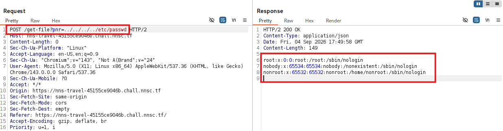
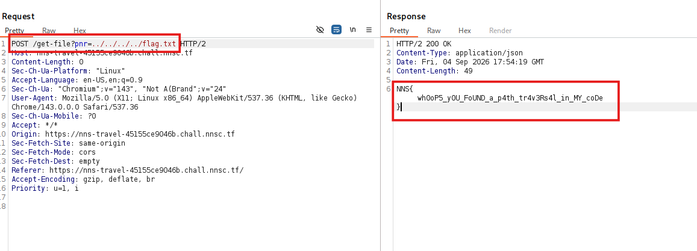

# Tổng quan
Những thông tin về challenge:
- Ngôn ngữ được sử dụng để xây dựng là TypeScript. TypeScript là ngôn ngữ mở rộng từ JS, nó hỗ trợ các dữ liệu tĩnh và kiểm tra biến đó trước khi chạy chương trình.
- Công nghệ phía server là Bun 1.4.0.
- Flag nằm ở /flag.txt

# Phân tích
Challenge này có chức năng khá đơn giản bao gồm:
- `/meta`: endpoint này chỉ trả về thông tin team
- `/get-file`: endpoint thực hiện lấy giá trị của tham số `pnr` ghép với path `./ticket/` sau đó sẽ được Bun.file xử lý . Mục đích là để đọc nội dung ticket trên server.
Từ chức năng trên mình sẽ đi sâu vào endpoint `/get-file` với lý do là giá trị của tham số `pnr` người dùng có thể kiểm soát, cơ chế kiểm tra đầu vào lỏng lẻo(chỉ phía front end) và quan trọng nhất là nó có sự tương tác với file hệ thống. 
Bun.file là function thực hiện thao tác với file bằng các lệnh system call nhanh của hệ điều hành nghĩa là nó sự hiện đọc file và trả về nội dung của file
# Kiểm thử
Với điểm yếu trong challenge thì lỗ hổng xảy ra là : Path Traversal. Test case để kiểm tra`../../../../etc/passwd`: Kết quả bên dưới cho thấy thông tin về user trong hệ thống được tiết lộ.

# Khai thác
Vì author cho biết flag nằm ở /flag.txt, mình lợi dụng path traversal bằng cách dùng chuỗi `../` để thoát khỏi thư mục /app/tickets, sau đó truy cập flag.txt.

Flag: ~~`NNS{wh0oP5_y0U_FoUND_a_p4th_tr4v3Rs4l_in_MY_coDe}`~~

