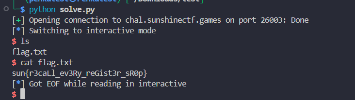

# Analysis
Khi bắt đầu phân tích binary, ta thấy chương trình trước hết in ra 8 byte từ stack. Giá trị này là một stack leak, giúp biết được địa chỉ stack tại thời điểm chạy. Sau đó chương trình nhận một input nhỏ để đi tiếp tới hàm quan trọng: hàm này gọi read với buffer tại rsp - 0x80, nhưng lại cho phép đọc đến 0x400 byte. Vì return address nằm tại rsp, chỉ cần gửi quá 0x80 byte là có thể ghi đè địa chỉ trả về và điều khiển RIP. Từ giá trị leak, ta tính được địa chỉ buffer bằng buf = leak - 0x80, tức biết chính xác nơi payload sẽ được đặt.

Ban đầu có thể nghĩ chỉ cần đặt shellcode ở đầu buffer, rồi ghi đè return address thành buf. Khi hàm kết thúc, lệnh ret sẽ nhảy vào shellcode. Tuy nhiên stack trên môi trường chạy thực tế không có quyền execute, nên CPU sẽ gây lỗi khi cố thực thi instruction tại địa chỉ stack. Vì vậy trước khi nhảy vào buf, cần gọi mprotect để đổi quyền của page stack chứa buffer thành RWX.

Để gọi syscall mprotect, cần thiết lập rax = 10, rdi là địa chỉ page stack đã align, rsi = 0x1000 và rdx = 7. Binary lại quá nhỏ và không có các gadget ROP cần thiết để nạp từng thanh ghi như pop rdi; ret, pop rsi; ret hay pop rdx; ret. Do đó exploit dùng SROP. SROP cho phép tạo một fake signal frame trên stack, sau đó gọi syscall rt_sigreturn; kernel sẽ đọc frame này và khôi phục các thanh ghi theo giá trị mình đã chuẩn bị.

Payload được đặt trong buffer của read thứ 2. Đầu buffer là shellcode, tại offset 0x80 là địa chỉ 0x401016, tại offset tiếp theo là 0x40104c, rồi đến fake signal frame. Khi read lớn kết thúc, ret lấy địa chỉ tại buf + 0x80 và nhảy đến routine 0x401016. Routine này leak thêm 8 byte rồi thực hiện một read thứ 1. Exploit gửi chính xác 15 byte cho lần đọc này. Giá trị trả về của read được lưu vào rax, nên sau lần đọc đó rax = 15.

Routine tiếp tục với lệnh ret. Ta đã đặt 0x40104c làm return address tiếp theo; đây là instruction syscall. Vì nó được chạy khi rax = 15, kernel hiểu đây là syscall rt_sigreturn. Không có signal thật nào được gửi: exploit chỉ gọi trực tiếp syscall vốn thường được kernel dùng để kết thúc signal handler.

Tại thời điểm rt_sigreturn chạy, rsp trỏ vào fake frame đã được đặt sẵn sau 0x40104c. Kernel đọc frame và nạp các giá trị do exploit chọn: syscall số 10 (mprotect), địa chỉ page chứa buf, kích thước 0x1000, quyền 7, cùng địa chỉ gadget syscall; ret. Kernel quay lại gadget đó, mprotect làm page stack trở thành RWX, rồi instruction ret lấy địa chỉ buf đã được đặt ở buf + 0x200. Cuối cùng CPU nhảy về buf và thực thi shellcode đã nằm tại đầu buffer, từ đó chạy /bin/sh.
# Exploit Script
```python
from pwn import *

context.update(arch="amd64", os="linux", log_level="info")
io = remote("chal.sunshinectf.games",26003)


leak = u64(io.recvn(8))
buf = leak - 0x80

io.send(b"A" * 0x18)

frame = SigreturnFrame()
frame.rax = constants.SYS_mprotect
frame.rdi = buf & ~0xfff
frame.rsi = 0x1000
frame.rdx = 7
frame.rip = 0x401069                 
frame.rsp = buf + 0x200              

shellcode = asm(shellcraft.sh())
payload = shellcode.ljust(0x80, b"\x90")
payload += p64(0x401016)             
payload += p64(0x40104c)             
payload += bytes(frame)
payload = payload.ljust(0x200, b"\x90")
payload += p64(buf)                  

io.send(payload)
io.recvn(8)
io.send(b"B" * 15)
io.interactive()


```

# Reference
[1]: https://x64.syscall.sh/
[2]: https://hacktricks.wiki/en/binary-exploitation/rop-return-oriented-programing/srop-sigreturn-oriented-programming/index.html