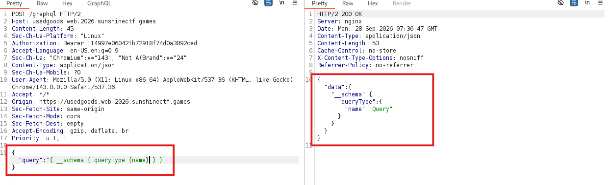
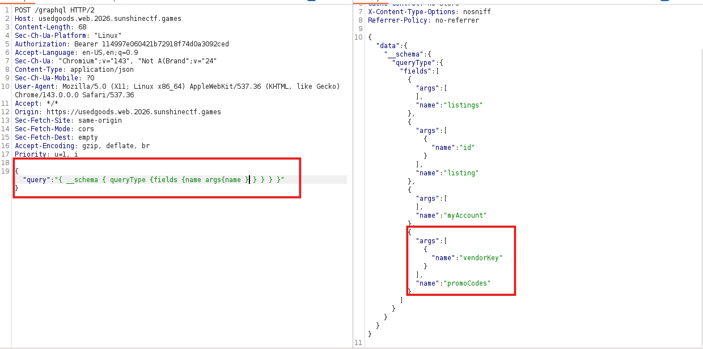
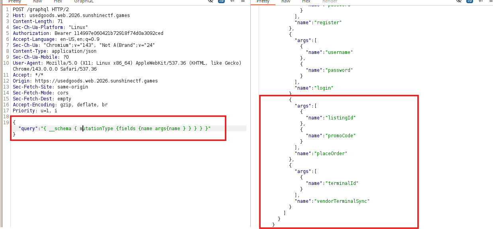
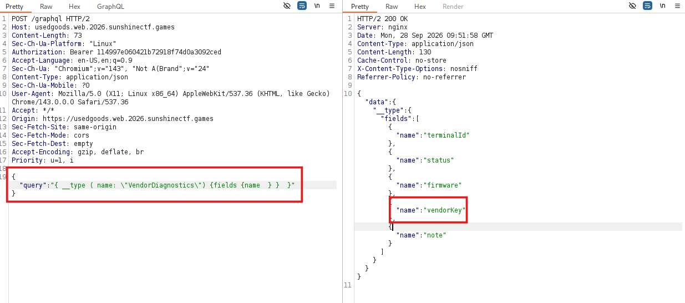
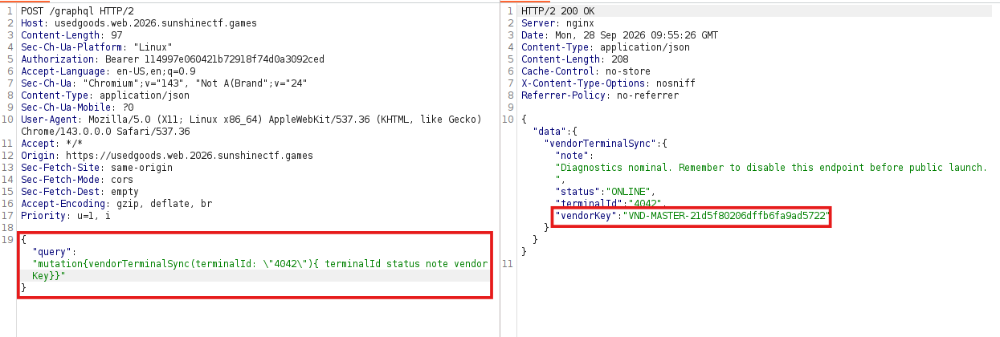
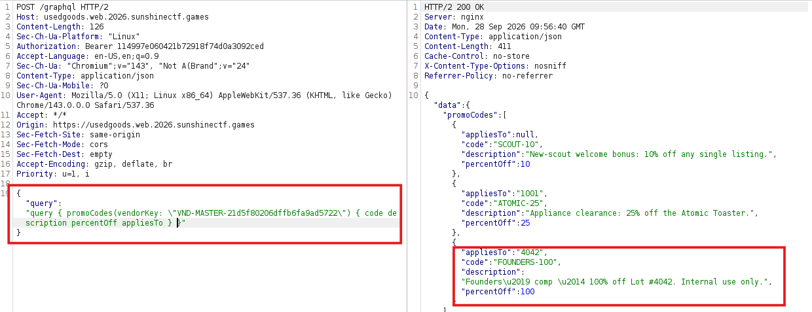
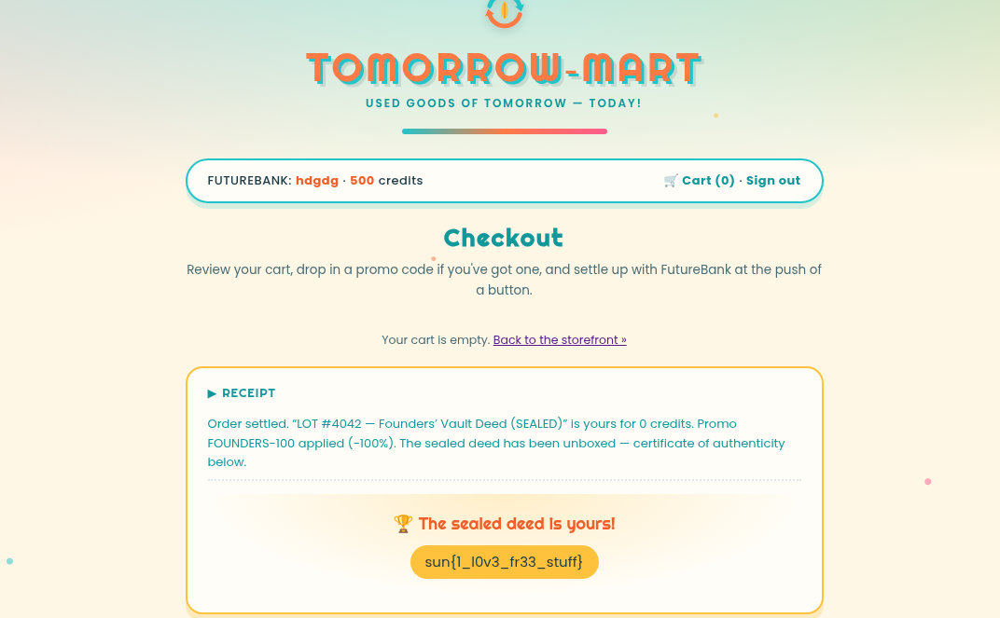

# Analysis
Theo mô tả và truy cập vào challenge mình đoán được bài này liên quan đến GrapQL. Kiểm tra xem có bật intropection 

Sau khi xác nhận ứng dụng có bật introspection, Mình sẽ tiếp tục liệt kê các `query` và `mutation`

Liệt kê các field và arg của các query thì mình thấy có `promoCodes` rất có thể sẽ lấy các phiếu giảm giá thông qua `vendorKey`

Vì vậy mình xem vendorkey được lấy từ đâu bằng cách kiểm tra thêm các `mutation`

Trong các mutation như `placeOrder` và `vendorTerminalSync` cần đáng quan tâm. Khi đi sâu vào `vendorTerminalSync` mình phát hiện khi thực hiện thao tác trên `terminalId` nó trả về object `VendorDiagnostics`. Kiểm tra các field trong object trên mình thấy được có fields `vendorKey`

Mục tiêu bài là mua được đơn hàng có id 4042 vậy nên mình sẽ gửi query để lấy được vendorkey của id `4042`

Sau khi tìm được vendorkey ta sẽ query promCodes với vendorkey "VND-MASTER-21d5f80206dffb6fa9ad5722"

Như vậy ta thấy có các promCode giảm 10%,25%,100%

# Solution

1. Lấy vendorKey tại mutation vendorTerminalSync với terminalId `4042`
2. Truy vấn để lấy phiếu giảm giá 100% tại `promoCodes` với vendorKey vừa lấy bước 1
3. Thêm product id 4042 vào giỏ và áp mã giảm giá lấy được bước 2.

